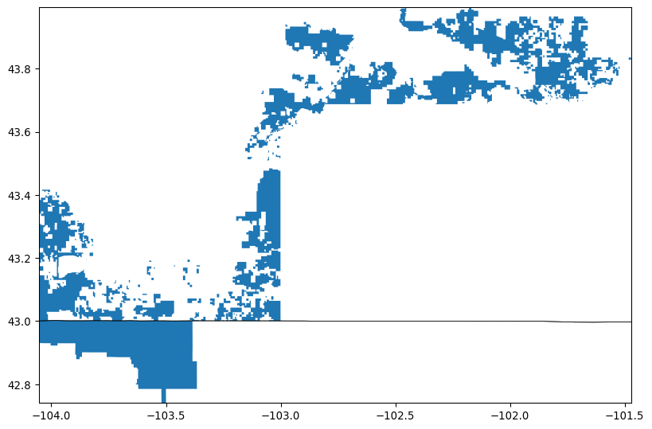
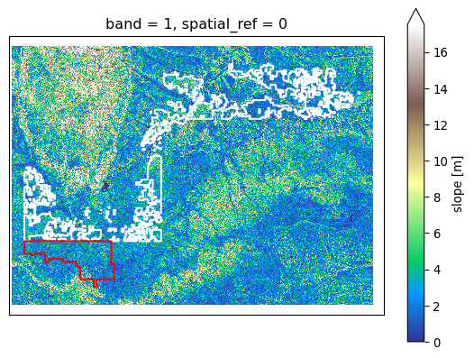
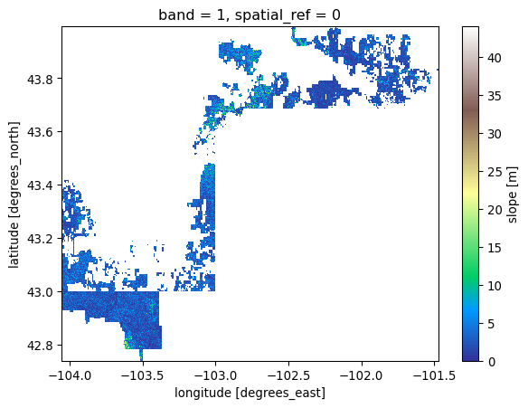

Currently using python 3.12.4, but want to use python 3.11.10 in virtual
environment This file will not render properly as it is stuck on
rendering with the default python (3.9.6). See
[simple.qmd](https://github.com/byandell-envsys/habitatSuitability/blob/main/simple.qmd)
for a way to examine environments.

/Users/brianyandell/.virtualenvs/r-reticulate/bin/python
/users/brianyandell/miniconda3/bin/python

:::: {.cell execution_count="1"}
``` {.python .cell-code}
import sys
print(sys.executable)
print(sys.version)
```

::: {.cell-output .cell-output-stdout}
    /users/brianyandell/miniconda3/envs/earth-analytics-python/bin/python
    3.11.10 | packaged by conda-forge | (main, Oct 16 2024, 01:26:25) [Clang 17.0.6 ]
:::
::::

# Buffalo Grasslands Habitat Suitability

This project examines habitat suitability for [Blue
Stem](https://greg.app/big-bluestem-soil/) in the [Buffalo
Gap](https://www.fs.usda.gov/recarea/nebraska/recarea/?recid=30329) and
[Oglala](https://www.fs.usda.gov/recarea/nebraska/recarea/?recid=30328)
National Grasslands. These grasslands contiguous, located in [Oceti
Sakowin
Oyate](https://americanindian.si.edu/nk360/plains-belonging-nation/oceti-sakowin),
also known as the Lakota Nation or Great Sioux Nation, and in the US
states of South Dakota and Nebraska.

Blue Stem, according to [Greg](https://greg.app/), "need well-drained,
nutrient-rich soils. The best soil types for this grass are sandy loam
or loamy soil, which provide the right balance of drainage and
nutrients. Aim for an organic matter content of 5-10%. This range is
crucial for optimal growth, as it enhances soil fertility and structure.
The ideal pH range for Big Bluestem is between 6.0 and 7.0. This
slightly acidic to neutral pH is essential for nutrient availability,
ensuring your plants can absorb what they need to thrive."

[Gardners.com](https://www.gardeners.com/how-to/what-type-of-soil-do-you-have/9120.html#:~:text=Most%20common%20garden%20plants%20prefer,well%2Dadapted%20to%20clay%20soils.)
has a [soil simplex
figure](https://www.gardeners.com/globalassets/articles/gardening/2014content/9120-soil-texture-triangle-sample.png?$staticlink$),
which puts sandy loam and loamy sand at 50-85% sand.

{fig-align="center"}

I don't seem to have information on slope or aspect, but I have seen
blue stem on flat areas and slopes.

### Project Specs

The project should compare

-   two grassland habitats: Buffalo Gap and Oglala National Grasslands
-   one species: Blue Stem
-   one soil measurement: percent sand, and maybe pH
-   two climate scenarios: (e.g. different time periods, different
    emission scenarios)
    -   [Relative concentration pathways
        (RCPs)](https://coastadapt.com.au/infographics/what-are-rcps)
        4.5 (current) and 8.5 (worse case)
-   one elevation: slope
-   fuzzy model based on above description

### Pseudocode

The pseudocode below relies on routines I developed with guidance from
course instructors and fellow students, organized with modules and their
functions in the package
[landmapy](https://github.com/byandell-envsys/landmapy) as
[DRY](https://www.getdbt.com/blog/guide-to-dry) code. Workflows cited
above have more detail on use and initial plots.

0.  Create GeoDataFrame `buffalo_gdf` is created in step 0 and then
    stored for later retrieval.
    -   `grassland_gdf = gpd.read_file(grassland_url)`
    -   `buffalo_gdf = grassland_gdf.loc[...]`
    -   `plot_redline(buffalo_gdf)`
1.  Soil and Climate Measures
    1.  Soil measure is `mean` of `sand` at depth `100-200m` is created
        (ignoring `buffer` of `0.1`) with functions
        -   `buffalo_da = merge_soil(buffalo_gdf, "sand", "mean", "100_200")`
        -   `gdf_over_da(buffalo_gdf, buffalo_da)`
    2.  Climate measures are projections of precipation `pr`
        -   [representative concentration
            pathway](https://sedac.ciesin.columbia.edu/ddc/ar5_scenario_process/RCPs.html)
            scenarios `rcp45`, `rcp85`
        -   `maca_df = process_maca({'buffalo': buffalo_gdf}, ['pr'], ['rcp85', 'rcp45'], [2026])`
        -   `maca_2027_year_da = maca_year(maca_df, 0, 2027)` \# 0 =
            `rcp85`, 1 = `rcp45`
        -   `gdf_over_da(buffalo_gdf, maca_2027_year_da)`
2.  Digital Elevation measure `slope`
    -   `srtm_da = srtm_download(buffalo_gdf, elevation_dir, 0.1)`
    -   `slope_da = srtm_slope(srtm_da)`
    -   `gdf_over_da(buffalo_gdf, slope_da)`
3.  Harmonize data
    -   `buffalo_sand_da = buffalo_da.rio.reproject_match(slope_da)`
    -   `maca_2027_da = maca_2027_year_da.rio.reproject_match(slope_da)`
    -   similar reproject idea for soil and climate variables
4.  Build fuzzy model
    -   use hill functions to transform harmonized DataArrays into 0-1
        DataArrays
    -   multiply them together
    -   `ramp_logic(maca_2027_da, (500, 550), (700, 750)).plot()`
    -   `ramp_logic(buffalo_sand_da, (50, 60), (80, 90)).plot()`
    -   `ramp_logic(slope_da, (0, 5), (15, 20)).plot()`

Workflow details were developed in separate jupyter notebooks. Working
documents that contribute to this workflow are as follows.

-   [0_study_area](https://github.com/byandell-envsys/habitatSuitability/blob/main/0_study_area.ipynb)
-   [1_1_soil](https://github.com/byandell-envsys/habitatSuitability/blob/main/1_1_soil.ipynb)
-   [1_2_climate](https://github.com/byandell-envsys/habitatSuitability/blob/main/1_2_climate.ipynb)
-   [2_slope](https://github.com/byandell-envsys/habitatSuitability/blob/main/2_slope.ipynb)
-   [3_harmonize](https://github.com/byandell-envsys/habitatSuitability/blob/main/3_harmonize.ipynb)
-   [4_build](https://github.com/byandell-envsys/habitatSuitability/blob/main/4_build.ipynb)

## Create Buffalo GeoDataFrame

Proposed sites are two contiguous national grasslands located in Oceti
Sakowin Oyate, also known as Great Lakota Nation and the US states of
South Dakota and Nebraska. They are [Buffalo Gap National
Grassland](https://www.fs.usda.gov/recarea/nebraska/recarea/?recid=30329)
and [Oglala National
Grassland](https://www.fs.usda.gov/recarea/nebraska/recarea/?recid=30328)

A GeoDataFrame `buffalo_gdf` is created and stored for later retrieval.
See
[0_study_area](https://github.com/byandell-envsys/habitatSuitability/blob/main/0_study_area.ipynb).
We use the `plot_redline()` function from
[landmapy.redline](https://github.com/byandell-envsys/landmapy/blob/main/landmapy/redline.py)
module to visualize.

### Grassland References

-   [Buffalo Gap National
    Grassland](https://www.fs.usda.gov/recarea/nebraska/recarea/?recid=30329)
    -   [Recreation
        Area](https://www.fs.usda.gov/detail/r2/recreation?cid=stelprdb5389082)
    -   [Natural
        Atlas](https://naturalatlas.com/national-grasslands/buffalo-gap-2096999)
    -   [Data
        Download](https://data-usfs.hub.arcgis.com/datasets/usfs::national-grassland-units-feature-layer/explore?location=43.534637%2C-102.565490%2C8.34)
    -   (OBJECTID 186937, NATIONALGRASSLANDID 295518010328)\
-   [Oglala National
    Grassland](https://www.fs.usda.gov/recarea/nebraska/recarea/?recid=30328)
    -   [Visit](https://visitnebraska.com/harrison/oglala-national-grassland)
    -   [Data
        Download](https://data-usfs.hub.arcgis.com/datasets/usfs::national-grassland-units-feature-layer/explore?location=43.509639%2C-102.570535%2C8.36)
    -   (OBJECTID 186940, NATIONALGRASSLANDID 295521010328)

### Python Code

::: {.cell execution_count="2"}
``` {.python .cell-code}
import os # Interoperable file paths
import pathlib # Find the home folder
import geopandas as gpd # read geojson file into gdf
from landmapy.redline import plot_redline # plot gdf
```
:::

:::: {.cell execution_count="3"}
``` {.python .cell-code}
# Define and create the project data directory
data_dir = os.path.join(
    pathlib.Path.home(),
    'earth-analytics',
    'data',
    'habitat'
)
os.makedirs(data_dir, exist_ok=True)
data_dir
```

::: {.cell-output .cell-output-display execution_count="21"}
    '/Users/brianyandell/earth-analytics/data/habitat'
:::
::::

:::: {.cell execution_count="4"}
``` {.python .cell-code}
grassland_url = data_dir + "/National_Grassland_Units_(Feature_Layer).geojson"
print(grassland_url)
grassland_gdf = gpd.read_file(grassland_url)
```

::: {.cell-output .cell-output-stdout}
    /Users/brianyandell/earth-analytics/data/habitat/National_Grassland_Units_(Feature_Layer).geojson
:::
::::

:::: {.cell execution_count="5"}
``` {.python .cell-code}
buffalo_gdf = grassland_gdf.loc[grassland_gdf['GRASSLANDNAME'].isin(
    ["Buffalo Gap National Grassland", "Oglala National Grassland"])]
plot_redline(buffalo_gdf)
```

::: {.cell-output .cell-output-display}

:::
::::

## Soil and Climate Measures

Download soil raster layer for **sand** covering study area envelope
using the [POLARIS
dataset](http://hydrology.cee.duke.edu/POLARIS/PROPERTIES/v1.0/).
Considering `sand` percentage `mean`. POLARIS data are available at 6
depths, and Bluestem has roots down to 5 feet (150 cm), which is the
lowest strata measured (100-200 cm). Data in the [sand 100-200 cm
directory](http://hydrology.cee.duke.edu/POLARIS/PROPERTIES/v1.0/sand/mean/100_200/)
are saved as separate tif files by longitude. Buffalo Gap National
Grassland is at (centroid) 43.4375° N, 103.0505° W, while Oglala
National Grassland is at 42.9404° N, 103.5900° W. Below we use the
`.total_bounds` extension on `buffalo_gdf` with the `merge_soil()`
function in the
[landmapy.habitat](https://github.com/byandell-envsys/landmapy/blob/main/landmapy/habitat.py)
module to automate finding bounds.

-   [POLARIS: 30-meter probabilistic soil series map of contiguous
    US](https://pubs.usgs.gov/publication/70170912)
    -   <https://scholars.duke.edu/publication/1381493>
    -   <https://gee-community-catalog.org/projects/polaris/>
    -   NW Chaney et al. (2019) POLARIS Soil Properties: 30-m
        Probabilistic Maps of Soil Properties Over the Contiguous United
        States. [DOI:
        10.1029/2018WR022797](https://doi.org/10.1029/2018WR022797)
-   Elsa Culler EarthLab Videos
    -   [Accessing and formatting URLS for POLARIS
        data](https://cuboulder.zoom.us/rec/share/imhCGJcrCgSoE1cJjg02r86GMNjiRz0jwVMJ5c0uWNwBCD5D_0kLSl3CaqLdDI2a.ucGta1EEAiirDUop)
    -   [Looping through multiple tiles of POLARIS
        data](https://cuboulder.zoom.us/rec/share/3S7pGOSv7jztZTvg4RSXLj-GicnHwusIDIEDoETZbUN7ivkc6Ryi5GAJyX9Ly6h2.VXl6iFmLChjjUyOg)

### Sand Soil Measurement

Get and show `mean` of `sand` at depth `100-200m` with functions

-   `buffalo_da = merge_soil(buffalo_gdf, "sand", "mean", "100_200")`
-   `gdf_over_da(buffalo_gdf, buffalo_da)`

::: {.cell execution_count="6"}
``` {.python .cell-code}
from landmapy.habitat import merge_soil
from landmapy.index import gdf_over_da
```
:::

Merge soil tiles to create `buffalo_da`.

:::: {.cell execution_count="7"}
``` {.python .cell-code}
print(buffalo_gdf.total_bounds)
buffalo_da = merge_soil(buffalo_gdf)
```

::: {.cell-output .cell-output-stdout}
    [-104.05473027   42.74093601 -101.47233564   43.99459902]
    -105 42
    -105 43
    -104 42
    -104 43
    -103 42
    -103 43
    -102 42
    -102 43
    lon-105lat42
    lon-105lat43
    lon-104lat42
    lon-104lat43
    lon-103lat42
    lon-103lat43
    lon-102lat42
    lon-102lat43
    Done.
:::
::::

::::: {.cell execution_count="8"}
``` {.python .cell-code}
buffalo_gdf['color'] = ['white','red']
gdf_over_da(buffalo_gdf, buffalo_da, cmap='viridis')
```

::: {.cell-output .cell-output-stderr}
    /users/brianyandell/miniconda3/envs/earth-analytics-python/lib/python3.11/site-packages/geopandas/geodataframe.py:1819: SettingWithCopyWarning: 
    A value is trying to be set on a copy of a slice from a DataFrame.
    Try using .loc[row_indexer,col_indexer] = value instead

    See the caveats in the documentation: https://pandas.pydata.org/pandas-docs/stable/user_guide/indexing.html#returning-a-view-versus-a-copy
      super().__setitem__(key, value)
:::

::: {.cell-output .cell-output-display}

:::
:::::

### Climate Precipitation Measure

Project precipation `pr` under representative concentration pathway
scenarios `rcp45` and `rcp85` for years `2026-2030`.

::: {.cell execution_count="9"}
``` {.python .cell-code}
from landmapy.habitat import process_maca, maca_year
from landmapy.index import gdf_over_da
```
:::

:::: {.cell execution_count="10"}
``` {.python .cell-code}
maca_df = process_maca({'buffalo': buffalo_gdf})
maca_df[['site_name', 'scenario', 'climate', 'year']]
```

::: {.cell-output .cell-output-display execution_count="28"}
<div>
<style scoped>
    .dataframe tbody tr th:only-of-type {
        vertical-align: middle;
    }

    .dataframe tbody tr th {
        vertical-align: top;
    }

    .dataframe thead th {
        text-align: right;
    }
</style>

      site_name   scenario   climate   year
  --- ----------- ---------- --------- ------
  0   buffalo     pr         rcp85     2026
  1   buffalo     pr         rcp45     2026

</div>
:::
::::

:::: {.cell execution_count="11"}
``` {.python .cell-code}
maca_2027_year_da = maca_year(maca_df, 0, 2027) # 0 = `rcp85`, 1 = `rcp45`
gdf_over_da(buffalo_gdf, maca_2027_year_da)
```

::: {.cell-output .cell-output-display}

:::
::::

Repeat for `rcp45`. Make nice plot pair.

## Slope Elevation variable `slope`

-   `srtm_da = srtm_download(buffalo_gdf, elevation_dir, 0.1)`
-   `slope_da = srtm_slope(srtm_da)`
-   `gdf_over_da(buffalo_gdf, slope_da)`

::: {.cell execution_count="12"}
``` {.python .cell-code}
import earthaccess
from landmapy.habitat import create_data_dir, srtm_download, srtm_slope
from landmapy.index import gdf_over_da 
```
:::

:::: {.cell execution_count="13"}
``` {.python .cell-code}
project_dir = create_data_dir('habitat')
elevation_dir = create_data_dir('habitat/srtm')
elevation_dir
```

::: {.cell-output .cell-output-display execution_count="31"}
    '/Users/brianyandell/earth-analytics/data/habitat/srtm'
:::
::::

:::: {.cell execution_count="14"}
``` {.python .cell-code}
earthaccess.login()
datasets = earthaccess.search_datasets(keyword='SRTM DEM', count=11)
for dataset in datasets:
    print(dataset['umm']['ShortName'], dataset['umm']['EntryTitle']) # want 'umn'
# want SRTMGL1? 1 arc second = 30m (also, 3, 30 arc second)
```

::: {.cell-output .cell-output-stdout}
    NASADEM_SHHP NASADEM SRTM-only Height and Height Precision Mosaic Global 1 arc second V001
    NASADEM_SIM NASADEM SRTM Image Mosaic Global 1 arc second V001
    NASADEM_SSP NASADEM SRTM Subswath Global 1 arc second V001
    C_Pools_Fluxes_CONUS_1837 CMS: Terrestrial Carbon Stocks, Emissions, and Fluxes for Conterminous US, 2001-2016
    SRTMGL1 NASA Shuttle Radar Topography Mission Global 1 arc second V003
    GEDI01_B GEDI L1B Geolocated Waveform Data Global Footprint Level V002
    NASADEM_HGT NASADEM Merged DEM Global 1 arc second V001
    SRTMGL3 NASA Shuttle Radar Topography Mission Global 3 arc second V003
    GEDI02_B GEDI L2B Canopy Cover and Vertical Profile Metrics Data Global Footprint Level V002
    SRTMGL1_NC NASA Shuttle Radar Topography Mission Global 1 arc second NetCDF V003
    SRTMGL30 NASA Shuttle Radar Topography Mission Global 30 arc second V002
:::
::::

:::: {.cell execution_count="15"}
``` {.python .cell-code}
srtm_da = srtm_download(buffalo_gdf, elevation_dir, 0.1)
gdf_over_da(buffalo_gdf, srtm_da, cmap='terrain')
```

::: {.cell-output .cell-output-display}

:::
::::

:::: {.cell execution_count="16"}
``` {.python .cell-code}
slope_da = srtm_slope(srtm_da)
gdf_over_da(buffalo_gdf, slope_da, cmap='terrain')
```

::: {.cell-output .cell-output-display}

:::
::::

Alternate plot only inside grasslands. Want to smooth over `buffalo_gdf`
to fill in internal holes.

:::: {.cell execution_count="17"}
``` {.python .cell-code}
import matplotlib.pyplot as plt # Overlay raster and vector data

slope_clip_da = slope_da.rio.clip(buffalo_gdf.geometry)
slope_clip_da.plot(cmap='terrain')
#buffalo_gdf.boundary.plot(ax=plt.gca(), color = "black", linewidth=0.5)
plt.show()
```

::: {.cell-output .cell-output-display}

:::
::::

## Harmonize data

See
[3_harmonize](https://github.com/byandell-envsys/habitatSuitability/blob/main/3_harmonize.ipynb).

::: {.cell execution_count="18"}
``` {.python .cell-code}
buffalo_sand_da = buffalo_da.rio.reproject_match(slope_da)
maca_2027_da = maca_2027_year_da.rio.reproject_match(slope_da)
```
:::

## Fuzzy Model

-   use hill functions to transform harmonized DataArrays into 0-1
    DataArrays
-   multiply them together

See
[4_build](https://github.com/byandell-envsys/habitatSuitability/blob/main/4_build.ipynb)
