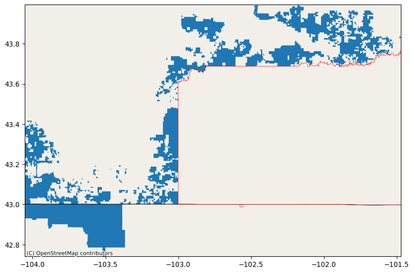

# Buffalo Grasslands Habitat Suitability

-   [Create Buffalo GeoDataFrame](#create-buffalo-geodataframe)
-   [Soil and Climate Measures](#soil-and-climate-measures)
    -   [Sand Soil Measure](#sand-soil-measure)
    -   [Climate Precipitation Measure](#climate-precipitation-measure)
-   [Slope Elevation Measure](#slope-elevation-measure)
-   [Harmonize Data](#harmonize-data)
-   [Fuzzy Model](#fuzzy-model)
-   [Appendix: Technical Details](#appendix-technical-details)

This project examines habitat suitability for [Blue
Stem](https://greg.app/big-bluestem-soil/) in the [Buffalo
Gap](https://www.fs.usda.gov/recarea/nebraska/recarea/?recid=30329) and
[Oglala](https://www.fs.usda.gov/recarea/nebraska/recarea/?recid=30328)
National Grasslands. These contiguous grasslands are located in [Oceti
Sakowin
Oyate](https://americanindian.si.edu/nk360/plains-belonging-nation/oceti-sakowin),
also known as the Lakota Nation or Great Sioux Nation, and in the US
states of South Dakota and Nebraska. For more information see [Oceti
Sakowin Essential Understandings &
Standards](https://sdtribalrelations.sd.gov/docs/OSEUs-18.pdf).

Blue Stem, according to [Greg](https://greg.app/), "need well-drained,
nutrient-rich soils. The best soil types for this grass are sandy loam
or loamy soil, which provide the right balance of drainage and
nutrients. Aim for an organic matter content of 5-10%. This range is
crucial for optimal growth, as it enhances soil fertility and structure.
The ideal pH range for Big Bluestem is between 6.0 and 7.0. This
slightly acidic to neutral pH is essential for nutrient availability,
ensuring your plants can absorb what they need to thrive."

[Gardners.com](https://www.gardeners.com/how-to/what-type-of-soil-do-you-have/9120.html#:~:text=Most%20common%20garden%20plants%20prefer,well%2Dadapted%20to%20clay%20soils.)
has a [soil simplex
figure](https://www.gardeners.com/globalassets/articles/gardening/2014content/9120-soil-texture-triangle-sample.png?$staticlink$),
which puts sandy loam and loamy sand at 50-85% sand.

{fig-align="center"}

I could not find information on slope or aspect but I have seen blue
stem on flat areas and slopes.

## Create Buffalo GeoDataFrame

First visit [USFS Geospatial Data Discovery: National Grassland Units
(Feature
Layer)](https://data-usfs.hub.arcgis.com/datasets/usfs::national-grassland-units-feature-layer/explore)
and manually download GeoJSON file from DataSet into directory
`~/earth-analytics/data/habitat` (see `create_data_dir()` below). A
GeoDataFrame `buffalo_gdf` is created and stored for later retrieval to
save time. The `plot_redline()` function is from
[landmapy.redline](https://github.com/byandell-envsys/landmapy/blob/main/landmapy/redline.py)
module to visualize.

::: {.cell execution_count="1"}
``` {.python .cell-code}
import geopandas as gpd # read geojson file into gdf
from landmapy.habitat import create_data_dir # create (or retrieve) data directory
from landmapy.redline import plot_redline # plot gdf
```
:::

:::: {.cell execution_count="2"}
``` {.python .cell-code}
%store -r buffalo_gdf
try:
    buffalo_gdf
except NameError:
    data_dir = create_data_dir('habitat')
    # Read all grasslands GeoJSON into `grassland_gdf`.
    grassland_url = f"{data_dir}/National_Grassland_Units_(Feature_Layer).geojson"
    grassland_gdf = gpd.read_file(grassland_url)
    # Subset to desired locations.
    buffalo_gdf = grassland_gdf.loc[grassland_gdf['GRASSLANDNAME'].isin(
        ["Buffalo Gap National Grassland", "Oglala National Grassland"])]
    %store buffalo_gdf
    print("buffalo_gdf created and stored")
else:
    print("buffalo_gdf retrieved from StoreMagic")
```

::: {.cell-output .cell-output-stdout}
    buffalo_gdf retrieved from StoreMagic
:::
::::

:::: {.cell execution_count="3"}
``` {.python .cell-code}
plot_redline(buffalo_gdf)
```

::: {.cell-output .cell-output-display}
{#fig-grasslands}
:::
::::

## Soil and Climate Measures

Download soil raster layer for **sand** covering study area envelope
using the [POLARIS
dataset](http://hydrology.cee.duke.edu/POLARIS/PROPERTIES/v1.0/).
Considering `sand` percentage `mean`. POLARIS data are available at 6
depths, and Bluestem has roots down to 5 feet (150 cm), which is the
lowest strata measured (100-200 cm). Data in the [sand 100-200 cm
directory](http://hydrology.cee.duke.edu/POLARIS/PROPERTIES/v1.0/sand/mean/100_200/)
are saved as separate tif files by longitude. Buffalo Gap National
Grassland is at (centroid) 43.4375° N, 103.0505° W, while Oglala
National Grassland is at 42.9404° N, 103.5900° W. Below we use the
`.total_bounds` extension on `buffalo_gdf` with the `merge_soil()`
function in the
[landmapy.habitat](https://github.com/byandell-envsys/landmapy/blob/main/landmapy/habitat.py)
module to automate finding bounds.

### Sand Soil Measure

Get and show `mean` of `sand` at depth `100-200m` with functions

-   `buffalo_da = merge_soil(buffalo_gdf, "sand", "mean", "100_200")`
-   `gdf_over_da(buffalo_gdf, buffalo_da)`

::: {.cell execution_count="4"}
``` {.python .cell-code}
from landmapy.habitat import merge_soil # merge soil data from GDF
from landmapy.index import gdf_over_da # plot GDF over DA
```
:::

Merge soil tiles to create `buffalo_da`.

:::: {.cell execution_count="5"}
``` {.python .cell-code}
print(buffalo_gdf.total_bounds)
%store -r buffalo_da
try:
    buffalo_da
except NameError:
    buffalo_da = merge_soil(buffalo_gdf)
    print("buffalo_da merged soil from buffalo_gdf and stored")
else:
    print("buffalo_da soil merge retrieved")
```

::: {.cell-output .cell-output-stdout}
    [-104.05473027   42.74093601 -101.47233564   43.99459902]
    buffalo_da soil merge retrieved
:::
::::

:::: {.cell execution_count="6"}
``` {.python .cell-code}
buffalo_gdf['color'] = ['white','red']
gdf_over_da(buffalo_gdf, buffalo_da, cmap='viridis')
```

::: {.cell-output .cell-output-display}
{#fig-soil}
:::
::::

### Climate Precipitation Measure

Project precipation `pr` under representative concentration pathway
scenarios `rcp45` and `rcp85` for years `2026-2030`.

::: {.cell execution_count="7"}
``` {.python .cell-code}
from landmapy.habitat import process_maca, maca_year
from landmapy.index import gdf_over_da
```
:::

:::: {.cell execution_count="8"}
``` {.python .cell-code}
maca_df = process_maca({'buffalo': buffalo_gdf})
maca_df[['site_name', 'scenario', 'climate', 'year']]
```

::: {.cell-output .cell-output-display execution_count="8"}
<div>
<style scoped>
    .dataframe tbody tr th:only-of-type {
        vertical-align: middle;
    }

    .dataframe tbody tr th {
        vertical-align: top;
    }

    .dataframe thead th {
        text-align: right;
    }
</style>

      site_name   scenario   climate   year
  --- ----------- ---------- --------- ------
  0   buffalo     pr         rcp85     2026
  1   buffalo     pr         rcp45     2026

</div>
:::
::::

:::: {.cell execution_count="9"}
``` {.python .cell-code}
maca_2027_year_da = maca_year(maca_df, 0, 2027) # 0 = `rcp85`, 1 = `rcp45`
gdf_over_da(buffalo_gdf, maca_2027_year_da)
```

::: {.cell-output .cell-output-display}
{#fig-maca}
:::
::::

Repeat for `rcp45`. Make nice plot pair. Will need to modify
`gdf_over_da()` to return object rather than create plot. This probably
has some subtleties.

## Slope Elevation Measure

::: {.cell execution_count="10"}
``` {.python .cell-code}
import earthaccess
from landmapy.habitat import create_data_dir, srtm_download, srtm_slope
from landmapy.index import gdf_over_da 
```
:::

:::: {.cell execution_count="11"}
``` {.python .cell-code}
project_dir = create_data_dir('habitat')
elevation_dir = create_data_dir('habitat/srtm')
elevation_dir
```

::: {.cell-output .cell-output-display execution_count="11"}
    '/Users/brianyandell/earth-analytics/data/habitat/srtm'
:::
::::

:::: {.cell execution_count="12"}
``` {.python .cell-code}
earthaccess.login()
datasets = earthaccess.search_datasets(keyword='SRTM DEM', count=11)
for dataset in datasets:
    print(dataset['umm']['ShortName'], dataset['umm']['EntryTitle']) # want 'umn'
# want SRTMGL1? 1 arc second = 30m (also, 3, 30 arc second)
```

::: {.cell-output .cell-output-stdout}
    NASADEM_SHHP NASADEM SRTM-only Height and Height Precision Mosaic Global 1 arc second V001
    NASADEM_SIM NASADEM SRTM Image Mosaic Global 1 arc second V001
    NASADEM_SSP NASADEM SRTM Subswath Global 1 arc second V001
    C_Pools_Fluxes_CONUS_1837 CMS: Terrestrial Carbon Stocks, Emissions, and Fluxes for Conterminous US, 2001-2016
    SRTMGL1 NASA Shuttle Radar Topography Mission Global 1 arc second V003
    GEDI01_B GEDI L1B Geolocated Waveform Data Global Footprint Level V002
    NASADEM_HGT NASADEM Merged DEM Global 1 arc second V001
    SRTMGL3 NASA Shuttle Radar Topography Mission Global 3 arc second V003
    GEDI02_B GEDI L2B Canopy Cover and Vertical Profile Metrics Data Global Footprint Level V002
    SRTMGL1_NC NASA Shuttle Radar Topography Mission Global 1 arc second NetCDF V003
    SRTMGL30 NASA Shuttle Radar Topography Mission Global 30 arc second V002
:::
::::

::::: {.cell execution_count="13"}
``` {.python .cell-code}
srtm_da = srtm_download(buffalo_gdf, elevation_dir, 0.1)
gdf_over_da(buffalo_gdf, srtm_da, cmap='terrain')
```

::: {.cell-output .cell-output-stderr}
    /users/brianyandell/miniconda3/envs/earth-analytics-python/lib/python3.11/site-packages/dask/dataframe/__init__.py:49: FutureWarning: 
    Dask dataframe query planning is disabled because dask-expr is not installed.

    You can install it with `pip install dask[dataframe]` or `conda install dask`.
    This will raise in a future version.

      warnings.warn(msg, FutureWarning)
:::

::: {.cell-output .cell-output-display}
{#fig-srtm}
:::
:::::

:::: {.cell execution_count="14"}
``` {.python .cell-code}
slope_da = srtm_slope(srtm_da)
gdf_over_da(buffalo_gdf, slope_da, cmap='terrain')
```

::: {.cell-output .cell-output-display}
{#fig-slope}
:::
::::

Alternate plot only inside grasslands. Want to smooth over `buffalo_gdf`
to fill in internal holes.

:::: {.cell execution_count="15"}
``` {.python .cell-code}
import matplotlib.pyplot as plt # Overlay raster and vector data

slope_clip_da = slope_da.rio.clip(buffalo_gdf.geometry)
slope_clip_da.plot(cmap='terrain')
#buffalo_gdf.boundary.plot(ax=plt.gca(), color = "black", linewidth=0.5)
plt.show()
```

::: {.cell-output .cell-output-display}
{#fig-slopeclip}
:::
::::

## Harmonize Data

See
[3_harmonize](https://github.com/byandell-envsys/habitatSuitability/blob/main/3_harmonize.ipynb).

::: {.cell execution_count="16"}
``` {.python .cell-code}
buffalo_sand_da = buffalo_da.rio.reproject_match(slope_da)
maca_2027_da = maca_2027_year_da.rio.reproject_match(slope_da)
```
:::

## Fuzzy Model

-   use hill functions to transform harmonized DataArrays into 0-1
    DataArrays
-   multiply them together

See
[4_build](https://github.com/byandell-envsys/habitatSuitability/blob/main/4_build.ipynb)

## Appendix: Technical Details

Currently using python 3.11.10 with the [`earth-analytics-python`
environment](https://github.com/earthlab/earth-analytics-python-env).
Using
[StoreMagic](https://ipython.readthedocs.io/en/stable/config/extensions/storemagic.html)
to store and retrieve intermediate calculations. Markdown rendered with
`quarto render buffalo.qmd -t markdown`. Code chunks are specific to
this project (using name `buffalo`) but use generic functions from the
[landmapy](https://github.com/byandell-envsys/landmapy) module.

-   [Project Specs](#project-specs)
-   [Pseudocode](#pseudocode)
-   [Grasslands References](#grasslands-references)
-   [Soil References](#soil-references)
-   [Climate References](#climate-references)
-   [Digital Elevation References](#digital-elevation-references)
-   [Harmonization References](#harmonization-references)
-   [Fuzzy Logic References](#fuzzy-logic-references)

### Project Specs

The project compares

-   two grassland habitats: Buffalo Gap and Oglala National Grasslands
-   one species: Blue Stem
-   one soil measurement: percent sand, and maybe pH
-   two climate scenarios: (e.g. different time periods, different
    emission scenarios)
    -   [Relative concentration pathways
        (RCPs)](https://coastadapt.com.au/infographics/what-are-rcps)
    -   `rcp45` (4.5 = current) and `rcp85` (8.5 = worse case)
-   one elevation: slope
-   fuzzy model based on above description

### Pseudocode

The pseudocode below relies on routines I developed with guidance from
course instructors and fellow students, organized with modules and their
functions in the package
[landmapy](https://github.com/byandell-envsys/landmapy) as
[DRY](https://www.getdbt.com/blog/guide-to-dry) code. Workflows cited
above have more detail on use and initial plots.

0.  Create GeoDataFrame `buffalo_gdf` is created in step 0 and then
    stored for later retrieval.
    -   `grassland_gdf = gpd.read_file(grassland_url)`
    -   `buffalo_gdf = grassland_gdf.loc[...]`
    -   `plot_redline(buffalo_gdf)`
1.  Soil and Climate Measures
    1.  Soil measure is `mean` of `sand` at depth `100-200m` is created
        (ignoring `buffer` of `0.1`) with functions
        -   `buffalo_da = merge_soil(buffalo_gdf, "sand", "mean", "100_200")`
        -   `gdf_over_da(buffalo_gdf, buffalo_da)`
    2.  Climate measures are projections of precipation `pr`
        -   [representative concentration
            pathway](https://sedac.ciesin.columbia.edu/ddc/ar5_scenario_process/RCPs.html)
            scenarios `rcp45`, `rcp85`
        -   `maca_df = process_maca({'buffalo': buffalo_gdf}, ['pr'], ['rcp85', 'rcp45'], [2026])`
        -   `maca_2027_year_da = maca_year(maca_df, 0, 2027)` \# 0 =
            `rcp85`, 1 = `rcp45`
        -   `gdf_over_da(buffalo_gdf, maca_2027_year_da)`
2.  Digital Elevation measure `slope`
    -   `srtm_da = srtm_download(buffalo_gdf, elevation_dir, 0.1)`
    -   `slope_da = srtm_slope(srtm_da)`
    -   `gdf_over_da(buffalo_gdf, slope_da)`
3.  Harmonize data
    -   `buffalo_sand_da = buffalo_da.rio.reproject_match(slope_da)`
    -   `maca_2027_da = maca_2027_year_da.rio.reproject_match(slope_da)`
    -   similar reproject idea for soil and climate variables
4.  Build fuzzy model
    -   use hill functions to transform harmonized DataArrays into 0-1
        DataArrays
    -   multiply them together
    -   `ramp_logic(maca_2027_da, (500, 550), (700, 750)).plot()`
    -   `ramp_logic(buffalo_sand_da, (50, 60), (80, 90)).plot()`
    -   `ramp_logic(slope_da, (0, 5), (15, 20)).plot()`

Workflow details were developed in separate jupyter notebooks. Working
documents that contribute to this workflow are as follows.

-   [0_study_area](https://github.com/byandell-envsys/habitatSuitability/blob/main/0_study_area.ipynb)
-   [1_1_soil](https://github.com/byandell-envsys/habitatSuitability/blob/main/1_1_soil.ipynb)
-   [1_2_climate](https://github.com/byandell-envsys/habitatSuitability/blob/main/1_2_climate.ipynb)
-   [2_slope](https://github.com/byandell-envsys/habitatSuitability/blob/main/2_slope.ipynb)
-   [3_harmonize](https://github.com/byandell-envsys/habitatSuitability/blob/main/3_harmonize.ipynb)
-   [4_build](https://github.com/byandell-envsys/habitatSuitability/blob/main/4_build.ipynb)

### Grasslands References

-   [Buffalo Gap National
    Grassland](https://www.fs.usda.gov/recarea/nebraska/recarea/?recid=30329)
    -   [Recreation
        Area](https://www.fs.usda.gov/detail/r2/recreation?cid=stelprdb5389082)
    -   [Natural
        Atlas](https://naturalatlas.com/national-grasslands/buffalo-gap-2096999)
    -   [Data
        Download](https://data-usfs.hub.arcgis.com/datasets/usfs::national-grassland-units-feature-layer/explore?location=43.534637%2C-102.565490%2C8.34)
    -   (OBJECTID 186937, NATIONALGRASSLANDID 295518010328)\
-   [Oglala National
    Grassland](https://www.fs.usda.gov/recarea/nebraska/recarea/?recid=30328)
    -   [Visit](https://visitnebraska.com/harrison/oglala-national-grassland)
    -   [Data
        Download](https://data-usfs.hub.arcgis.com/datasets/usfs::national-grassland-units-feature-layer/explore?location=43.509639%2C-102.570535%2C8.36)
    -   (OBJECTID 186940, NATIONALGRASSLANDID 295521010328)

### Soil References

-   [POLARIS: 30-meter probabilistic soil series map of contiguous
    US](https://pubs.usgs.gov/publication/70170912)
    -   <https://scholars.duke.edu/publication/1381493>
    -   <https://gee-community-catalog.org/projects/polaris/>
    -   NW Chaney et al. (2019) POLARIS Soil Properties: 30-m
        Probabilistic Maps of Soil Properties Over the Contiguous United
        States. [DOI:
        10.1029/2018WR022797](https://doi.org/10.1029/2018WR022797)
-   Elsa Culler EarthLab Videos
    -   [Accessing and formatting URLS for POLARIS
        data](https://cuboulder.zoom.us/rec/share/imhCGJcrCgSoE1cJjg02r86GMNjiRz0jwVMJ5c0uWNwBCD5D_0kLSl3CaqLdDI2a.ucGta1EEAiirDUop)
    -   [Looping through multiple tiles of POLARIS
        data](https://cuboulder.zoom.us/rec/share/3S7pGOSv7jztZTvg4RSXLj-GicnHwusIDIEDoETZbUN7ivkc6Ryi5GAJyX9Ly6h2.VXl6iFmLChjjUyOg)

### Climate References

Download climate raster layers covering study area envelope, including:

-   At least one **climate** variable from the [MACAv2 THREDDS data
    server](http://thredds.northwestknowledge.net:8080/thredds/reacch_climate_CMIP5_macav2_catalog2.html).
    -   Pick 2 of these
    -   [GeoNetwork](https://docs.geonetwork-opensource.org/4.2/):
        [THREDDS
        Harvesting](https://docs.geonetwork-opensource.org/4.2/user-guide/harvesting/harvesting-thredds/)
-   [CONUS
    Page](http://thredds.northwestknowledge.net:8080/thredds/catalog/MACAV2/BNU-ESM/catalog.html?dataset=REACCHDatasetScan_BNU-ESM_MACAV2/macav2metdata_pr_BNU-ESM_r1i1p1_rcp85_2026_2030_CONUS_monthly.nc)
    -   OPENDAP example URL:
        `http://thredds.northwestknowledge.net:8080/thredds/dodsC/MACAV2/BNU-ESM/macav2metdata_pr_BNU-ESM_r1i1p1_rcp85_2026_2030_CONUS_monthly.nc`
        (strip off trailing `.html`)
-   Climate Scenarios: Consider climate variables air termperature or
    precipitation (`_pr_`) with OPENDAP
    -   monthly data
    -   5-year interval (2026-30)
    -   [RCP](https://coastadapt.com.au/infographics/what-are-rcps) 4.5
        (current) vs 8.5 (high) \[third option: historical\]
-   [earthdatascience.org
    Tutorials](https://www.earthdatascience.org/courses/use-data-open-source-python)
    -   [EDA Lesson 2. Introduction to the CMIP and MACA v2 Climate
        Data](https://www.earthdatascience.org/courses/use-data-open-source-python/hierarchical-data-formats-hdf/intro-to-MACAv2-cmip5-data/).
    -   [EDA Lesson 3. How to Download MACA2 Climate Data Using
        Python](https://www.earthdatascience.org/courses/use-data-open-source-python/hierarchical-data-formats-hdf/get-maca-2-climate-data-netcdf-python/).
-   Elsa Video
    -   [MACA THREDDS Climate
        Projections](https://o365coloradoedu-my.sharepoint.com/personal/alpo6007_colorado_edu/_layouts/15/stream.aspx?id=%2Fpersonal%2Falpo6007%5Fcolorado%5Fedu%2FDocuments%2FAttachments%2FGMT20241204%2D184128%5FRecording%5F1758x1024%201%2Emp4&referrer=StreamWebApp%2EWeb&referrerScenario=AddressBarCopied%2Eview%2E9d3173e0%2D79c8%2D4027%2D95d3%2D7b49bec923d0)
-   Climate Scenario References
    -   [Representative Concentration Pathways -- RCCAP -- Regional
        Climate Consortium for Asia and the
        Pacific](https://www.rccap.org/guidance-and-case-studies/understanding-climate-model-data/representative-concentration-pathways/)
    -   <https://coastadapt.com.au/infographics/what-are-rcps>
    -   <https://climate.copernicus.eu/sites/default/files/2021-01/infosheet3.pdf>
    -   <https://oceanconservancy.org/blog/2022/03/01/ipcc/>
    -   <https://www.ipcc.ch/report/ar6/syr/> &
        <https://www.ipcc.ch/site/assets/uploads/2018/02/ar5_wgII_spm_en.pdf>
    -   <https://www.climatehubs.usda.gov/hubs/northwest/topic/what-are-climate-model-phases-and-scenarios>

### Digital Elevation References

Download elevation raster layer covering your study area envelope.
Consider **slope** or **aspect** to use in your model. Probably use the
[xarray-spatial](https://xarray-spatial.readthedocs.io/en/stable/)
library, which is available in the latest
`earth-analytics-python environment` (but will need to be
installed/updated if you are working on your own machine). Note that
calculated slope may not be correct if you are using a CRS with units of
*degrees*; re-project into a coordinate system with units of *meters*,
such as the appropriate [UTM Zone](https://pypi.org/project/utm-zone/).

Specifically, `X,Y` are `lon,lat` in degrees, while `Z` (height) is in
meters. Need to reproject into UTM with meters, which meanes we have to
find the UTM Zone. Need to find our area. The [UTM Zone
Finder](https://mapscaping.com/utm-zone-finder) shows that we are in
`UTM Zone 13` (and actually `13N` north). We need the projection (EPSG)
for UTM zone 13N, which is `EPSG:32613` by looking at <https://epsg.io>.

-   Elevation from the SRTM (available from the [earthaccess
    API](https://github.com/nsidc/earthaccess/))
-   Elsa video
    -   [Shuttle Radar Topology Mission
        (SRTM)](https://cuboulder.zoom.us/rec/play/6fTikKcJPbGPB321iHmAa3dhMUR7r0n_zSZ3XxjL-SfBLpVfsrZJ1CrHlkOrK6jvTlYgztvvskfvaAGP.T6ixGvWj42gYShMV?canPlayFromShare=true&from=share_recording_detail&continueMode=true&componentName=rec-play&originRequestUrl=https%3A%2F%2Fcuboulder.zoom.us%2Frec%2Fshare%2FploG3HVb_qA0QU8eACIHMKtNbkiGFys7cmiBbTRryv3NUWBmKo-DXhzXdU3cbpz7.99x0PeiCHONSj6Ty)

### Harmonization References

Make sure to reproject so grids for all layers match up. Check out the
[`ds.rio.reproject_match()`
method](https://corteva.github.io/rioxarray/stable/examples/reproject_match.html#Reproject-Match)
from [rioxarray](https://corteva.github.io/rioxarray/stable/).

[Harmonize
Video](https://cuboulder.zoom.us/rec/play/ekGBLwpW4gdtvlBstJrS_ehlAzq9INvK37XNdS8WKF-3WfE2xTiZmn1xIlFysuymN67yGbUeUJlpAwzS.HPT5luF6NWi8Ylsl?canPlayFromShare=true&from=share_recording_detail&continueMode=true&componentName=rec-play&originRequestUrl=https%3A%2F%2Fcuboulder.zoom.us%2Frec%2Fshare%2FgtkCgeowtvOgVPHDddcElI144wxCyHXOj1lKi5SEiMlxY1-L9Zm-PDBuTe6lh3Gm.S4X4wzflnTKXQtqr)

### Fuzzy Logic References

To train a fuzzy logic habitat suitability model:

1.  Research S. nutans, and find out what optimal values are for each
    variable you are using (e.g. soil pH, slope, and current
    climatological annual precipitation).
2.  For each **digital number** in each raster, assign a value from 0 to
    1 for how close that grid square is to the optimum range (1=optimal,
    0=incompatible).
3.  Combine your layers by multiplying them together. This will give you
    a **single suitability number** for each square. Check out this
    [article about raster
    math](https://www.earthdatascience.org/courses/use-data-open-source-python/intro-raster-data-python/raster-data-processing/subtract-rasters-in-python/)
    for more info.
4.  Optionally, you may apply a threshold to make the most suitable
    areas pop on your map.

**References**

-   <https://www.spiceworks.com/tech/devops/articles/fuzzy-logic/>
-   Demicco RV (2004) Ch 3: Fuzzy Logic and Earth Science: An Overview.
    In *Fuzzy Logic in Geology*, ed by Demicco RV, Klir GJ, Academic
    Press: pp 63-II.
    [DOI:10.1016/B978-012415146-8/50006-8](https://doi.org/10.1016/B978-012415146-8/50006-8).
-   [Subtract One Raster from Another and Export a New GeoTIFF in Open
    Source
    Python](https://www.earthdatascience.org/courses/use-data-open-source-python/intro-raster-data-python/raster-data-processing/subtract-rasters-in-python/)
